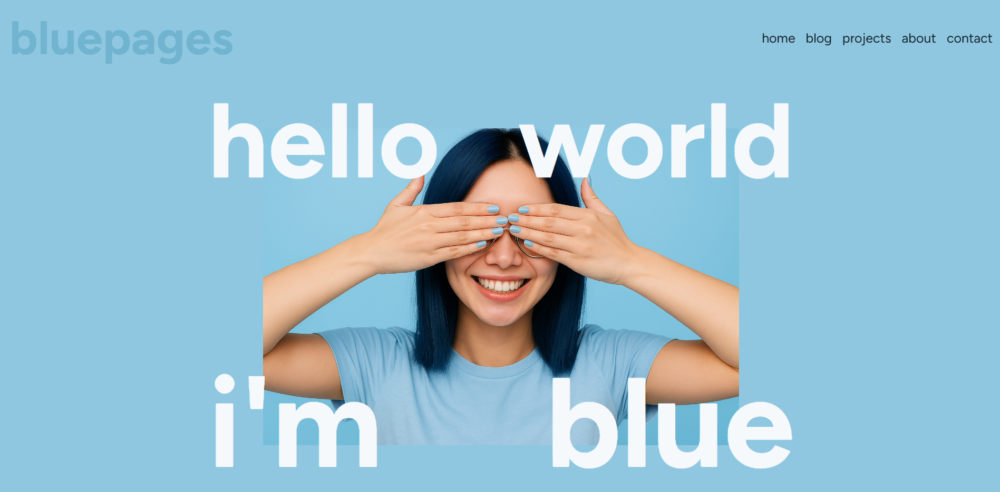

# bluepages 2026

## work in progress

bluepages is the personal blog+portfolio page of emily, a junior freelance frontend dev, blogger, dreamer, friend, daughter and pizza connoisseur. this is her digital home, where she shares her stories and code.

[now with live demo!]()

---

## features
- cool landing hero
- translucent header 
- responsive web design
- an epic javascript object for personal details
- carousel powered by shadcn/ui, populated using json files

---

## stack

bluepages is built using:
     

---

## installation
1. clone this repo
2. do `npm install`
3. do `npm run dev`
4. go to [`localhost:5173`](localhost:5173)
5. enjoy bluepages